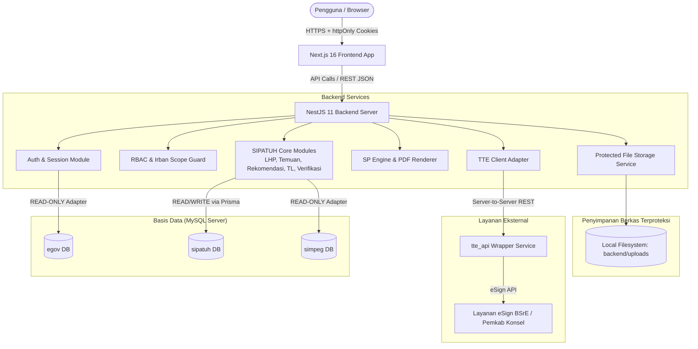

# SIPATUH - Arsitektur Sistem

## 1. Gambaran Umum Arsitektur
Aplikasi SIPATUH dibangun menggunakan pendekatan *modular monolith* dengan pemisahan tegas antara antarmuka pengguna (Frontend), logika bisnis & otentikasi (Backend), penyimpanan berkas terproteksi (Uploads), serta integrasi multi-database dan layanan eksternal.



---

## 2. Lapisan Frontend (`/frontend`)
* **Framework**: Next.js 16 (App Router), React 19, TypeScript.
* **State Management & Data Fetching**:
  * **TanStack Query (React Query)**: Mengelola server state, caching, refetching, serta status mutasi/loading.
  * **Zustand**: Mengelola client-only UI state minimal (misal: state toggle sidebar, filter sementara).
  * **Fetch Wrapper Khusus**:
    * Mengirim request dengan `credentials: 'include'` agar cookie sesi otomatis terkirim.
    * Menangani HTTP 401: melakukan *single-flight refresh token* ke `/api/v1/auth/refresh` lalu mengulang request awal tanpa menyebabkan *refresh loop*.
* **Styling**: Tailwind CSS v4.
* **Keamanan Klien**:
  * Tidak ada JWT, Access Token, Refresh Token, atau kata sandi yang disimpan di `localStorage` atau `sessionStorage`.
  * Rute dilindungi menggunakan route guard berbasis status otentikasi endpoint `/api/v1/auth/me`.

---

## 3. Lapisan Backend (`/backend`)
* **Framework**: NestJS 11 dengan TypeScript (Strict mode).
* **ORM & Database Client**:
  * **Prisma ORM**: Dikhususkan hanya untuk database `sipatuh`.
  * **Custom Raw Pool / Dedicated Read-Only Connection**: Untuk koneksi ke `egov` dan `simpeg` guna memastikan tidak ada skema asing yang terbawa ke migrasi Prisma `sipatuh`.
* **Struktur Modul Utama**:
  * `auth`: Otentikasi EGOV, penerbitan cookie JWT, verifikasi session.
  * `users`: Manajemen akun lokal pengguna SIPATUH.
  * `irban`: Manajemen data 5 Irban.
  * `external`:
    * `egov`: Adapter pembacaan kredensial EGOV secara *read-only*.
    * `simpeg`: Adapter pembacaan struktur instansi/unit kerja secara *read-only*.
    * `tte`: Klien komunikasi dengan service `tte_api`.
  * `master-data`: Kelola Jenis Pemeriksaan, Status Rekomendasi, Template Surat.
  * `lhp`: Pengelolaan LHP, penutupan (*closing*), dan pembukaan kembali (*reopen*).
  * `temuan` & `rekomendasi`: Domain butir temuan dan rekomendasi.
  * `tindak-lanjut` & `verifikasi`: Pencatatan histori tindak lanjut dan putusan verifikasi.
  * `surat-peringatan`: Penghitungan batas waktu (SP Engine), perakitan berkas draft, dan eksekusi TTE.
  * `reports` & `dashboard`: Agregasi data untuk Admin Irban dan Dashboard Pimpinan (Bupati/Inspektur).
  * `audit`: Layanan pencatatan audit log transaksi dan mutasi sistem.
  * `files`: Layanan penyimpanan, validasi tipe/ukuran, dan pengunduhan berkas terlindung (*protected download*).

---

## 4. Sistem Penyimpanan Berkas (`/backend/uploads`)
Folder penyimpanan berkas bersifat lokal di server dan tidak boleh dibuka ke publik (*no public static serving*). Setiap pengunduhan harus melewati endpoint controller berotentikasi.

Hierarki direktori penyimpanan:
```text
backend/uploads/
├── lhp/                      # Berkas dokumen LHP PDF
├── tindak-lanjut/            # Lampiran bukti dukung dari OPD (PDF, foto, dokumen)
├── verifikasi/               # Dokumen catatan/lampiran verifikasi verifikator
├── surat-peringatan/
│   ├── draft/                # PDF Surat Peringatan yang belum ditandatangani
│   └── signed/               # PDF Surat Peringatan yang telah berhasil di-TTE (immutable)
└── exports/                  # File unduhan ekspor Excel/PDF sementara
```

---

## 5. Keamanan & Kepatuhan
1. **Prinsip Hak Akses Terkecil (Least Privilege)**:
   * Kredensial MySQL untuk database `egov` dan `simpeg` hanya diberikan izin `SELECT`.
2. **Sanitasi Log**:
   * Token autentikasi, kata sandi, NIK lengkap, passphrase TTE, dan base64 berkas tidak boleh dicetak ke log aplikasi.
3. **Proteksi File Upload**:
   * Pengecekan ekstensi, tipe MIME, dan pembatasan ukuran berkas.
   * Nama berkas asli disimpan di database sebagai metadata; berkas di disk disimpan dengan UUID unik untuk mencegah manipulasi penamaan berkas atau path traversal.
