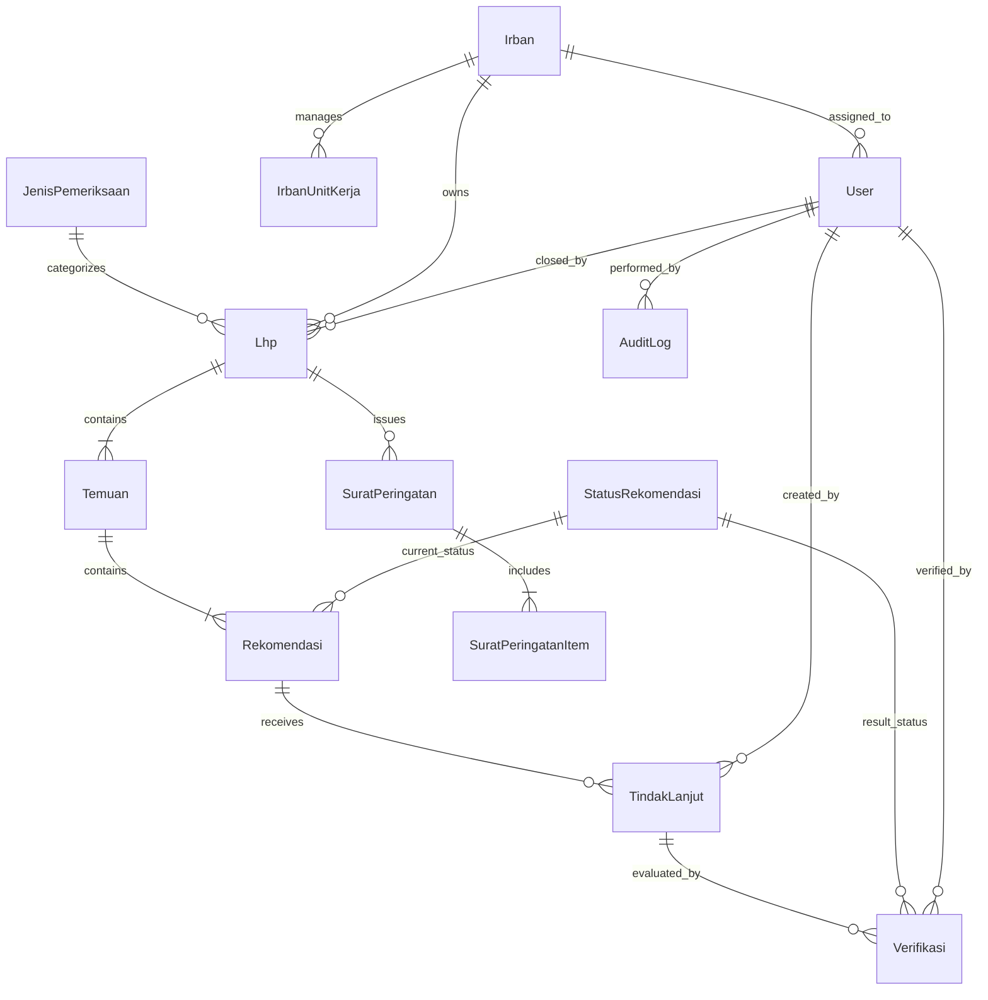

# SIPATUH - Data Model & Database Specification

Dokumen ini mendefinisikan skema data relasional untuk database utama `sipatuh` yang dikelola menggunakan Prisma ORM.

---

## 1. Entitas & Relasi Inti

---

## 2. Definisi Model Prisma (Draft Target)

### 2.1 Pengguna & Struktur Organisasi Lokal
* **`User`**:
  * `id`: `String` (UUID / CUID, Primary Key)
  * `egov_user_id`: `String` / `Int` (Referensi scalar ke pengguna di database EGOV, Unique)
  * `nip`: `String` (Snapshot NIP untuk referensi cepat)
  * `nama`: `String`
  * `role`: `RoleEnum` (`SUPER_ADMIN`, `ADMIN_IRBAN`, `BUPATI`)
  * `irban_id`: `String?` (Foreign Key ke `Irban`, wajib diisi jika role = `ADMIN_IRBAN`)
  * `is_active`: `Boolean` (Default: `true`)
  * `created_at`: `DateTime`
  * `updated_at`: `DateTime`

* **`Irban`**:
  * `id`: `String` (Primary Key)
  * `kode`: `String` (Misal: "IRBAN_1", "IRBAN_2", "IRBAN_3", "IRBAN_4", "IRBAN_5", Unique)
  * `nama`: `String` (Misal: "Inspektur Pembantu Wilayah I")
  * `created_at`: `DateTime`
  * `updated_at`: `DateTime`

* **`IrbanUnitKerja`**:
  * `id`: `String` (Primary Key)
  * `irban_id`: `String` (FK ke `Irban`)
  * `simpeg_unit_kerja_id`: `Int` / `String` (Referensi scalar ke ID unit kerja di database SIMPEG)
  * `created_at`: `DateTime`
  * `updated_at`: `DateTime`
  * *Constraint*: `UNIQUE(simpeg_unit_kerja_id)` (Satu OPD hanya boleh aktif di satu Irban pada satu waktu)

* **`PejabatUnitKerja`**:
  * `id`: `String` (Primary Key)
  * `simpeg_unit_kerja_id`: `Int` / `String` (Referensi scalar unit kerja SIMPEG)
  * `nip`: `String`
  * `nama`: `String`
  * `jabatan`: `String`
  * `jenis_penugasan`: `PenugasanEnum` (`DEFINITIF`, `PLT`, `PLH`)
  * `tanggal_mulai`: `DateTime`
  * `tanggal_selesai`: `DateTime?`
  * `is_active`: `Boolean` (Default: `true`)
  * `created_at`: `DateTime`
  * `updated_at`: `DateTime`

### 2.2 Master Data SIPATUH
* **`JenisPemeriksaan`**:
  * `id`: `String` (Primary Key)
  * `nama`: `String` (Seed awal: "Ketaatan", "Kinerja", "Dengan Tujuan Tertentu", "Investigatif")
  * `is_active`: `Boolean` (Default: `true`)
  * `created_at`: `DateTime`
  * `updated_at`: `DateTime`

* **`StatusRekomendasi`**:
  * `id`: `String` (Primary Key)
  * `nama`: `String` (Seed awal: "Sesuai", "Belum Sesuai", "Belum Ditindaklanjuti", "Tidak Dapat Ditindaklanjuti")
  * `kategori`: `KategoriStatusEnum` (`SELESAI`, `BELUM_SELESAI`)
  * `urutan`: `Int`
  * `is_active`: `Boolean` (Default: `true`)
  * `created_at`: `DateTime`
  * `updated_at`: `DateTime`

* **`SuratTemplate`**:
  * `id`: `String` (Primary Key)
  * `jenis_surat`: `String` (Misal: "SP1", "SP2", "SP3")
  * `judul`: `String`
  * `konten_html`: `String` (Template teks/HTML dengan placeholder variabel)
  * `versi`: `Int` (Default: 1, naik saat template diedit)
  * `is_active`: `Boolean` (Default: `true`)
  * `created_at`: `DateTime`
  * `updated_at`: `DateTime`

### 2.3 Domain Pemeriksaan & Pengawasan
* **`Lhp`**:
  * `id`: `String` (Primary Key)
  * `nomor_lhp`: `String` (Nomor surat LHP resmi)
  * `tanggal_lhp`: `DateTime` (Tanggal penerbitan LHP)
  * `tanggal_diterima_lhp`: `DateTime` (Tanggal diterima OPD; basis perhitungan countdown SP)
  * `tanggal_mulai_pemeriksaan`: `DateTime?`
  * `tanggal_selesai_pemeriksaan`: `DateTime?`
  * `simpeg_unit_kerja_id`: `Int` / `String` (Referensi unit kerja sasaran)
  * `irban_id`: `String` (Snapshot Irban penanggung jawab saat LHP dibuat, FK ke `Irban`)
  * `jenis_pemeriksaan_id`: `String` (FK ke `JenisPemeriksaan`)
  * `file_path`: `String?` (Lokasi dokumen fisik relatif terhadap root uploads)
  * `closed_at`: `DateTime?` (Timestamp saat LHP ditandai selesai)
  * `closed_by`: `String?` (FK ke `User`)
  * `reopen_reason`: `String?` (Alasan wajib jika LHP pernah dibuka kembali)
  * `created_at`: `DateTime`
  * `updated_at`: `DateTime`

* **`Temuan`**:
  * `id`: `String` (Primary Key)
  * `lhp_id`: `String` (FK ke `Lhp`)
  * `nomor_urut`: `Int` (Nomor urut temuan dalam 1 LHP: 1, 2, 3...)
  * `judul`: `String`
  * `uraian`: `String` (Deskripsi temuan)
  * `nilai_temuan`: `Decimal?` (Nilai nominal rupiah jika ada, Opsional)
  * `created_at`: `DateTime`
  * `updated_at`: `DateTime`
  * *Constraint*: `UNIQUE(lhp_id, nomor_urut)`

* **`Rekomendasi`**:
  * `id`: `String` (Primary Key)
  * `temuan_id`: `String` (FK ke `Temuan`)
  * `nomor_urut`: `Int` (Nomor urut rekomendasi dalam 1 Temuan: 1, 2, 3...)
  * `uraian`: `String` (Uraian saran rekomendasi tindak lanjut)
  * `nilai_rekomendasi`: `Decimal?` (Nilai nominal target pengembalian/kewajiban rupiah, Opsional)
  * `status_rekomendasi_id`: `String` (FK ke `StatusRekomendasi`)
  * `created_at`: `DateTime`
  * `updated_at`: `DateTime`
  * *Constraint*: `UNIQUE(temuan_id, nomor_urut)`

### 2.4 Domain Tindak Lanjut & Verifikasi
* **`TindakLanjut`**:
  * `id`: `String` (Primary Key)
  * `rekomendasi_id`: `String` (FK ke `Rekomendasi`)
  * `tanggal_diterima`: `DateTime` (Wajib, tanggal surat/dokumen diterima dari OPD)
  * `uraian`: `String` (Wajib, ringkasan materi tindak lanjut yang dilaporkan OPD)
  * `nilai_tindak_lanjut`: `Decimal?` (Opsional, nominal rupiah yang disetor/diselesaikan pada tahapan ini)
  * `created_by`: `String` (FK ke `User` pembuat/pencatat)
  * `created_at`: `DateTime`
  * `updated_at`: `DateTime`

* **`Verifikasi`**:
  * `id`: `String` (Primary Key)
  * `tindak_lanjut_id`: `String` (FK ke `TindakLanjut`)
  * `catatan`: `String` (Wajib, pertimbangan/catatan evaluasi oleh verifikator)
  * `status_rekomendasi_id`: `String` (FK ke `StatusRekomendasi` hasil verifikasi)
  * `verifier_id`: `String` (FK ke `User` pemeriksa)
  * `verified_at`: `DateTime`
  * `created_at`: `DateTime`

* **`Attachment`**:
  * `id`: `String` (Primary Key)
  * `owner_type`: `AttachmentTypeEnum` (`LHP`, `TINDAK_LANJUT`, `VERIFIKASI`)
  * `owner_id`: `String`
  * `original_name`: `String`
  * `stored_name`: `String` (UUID unik di disk)
  * `file_path`: `String` (Relatif terhadap direktori uploads)
  * `mime_type`: `String`
  * `file_size`: `Int`
  * `created_at`: `DateTime`

### 2.5 Domain Surat Peringatan & TTE
* **`SuratPeringatan`**:
  * `id`: `String` (Primary Key)
  * `lhp_id`: `String` (FK ke `Lhp`)
  * `level`: `SpLevelEnum` (`SP1`, `SP2`, `SP3`)
  * `nomor_surat`: `String` (Wajib unik)
  * `tanggal_surat`: `DateTime`
  * `simpeg_unit_kerja_id`: `Int` / `String`
  * `recipient_nip`: `String` (Snapshot NIP pejabat penerima)
  * `recipient_nama`: `String` (Snapshot nama pejabat penerima)
  * `recipient_jabatan`: `String` (Snapshot nama jabatan)
  * `template_version`: `Int`
  * `draft_path`: `String?` (Path PDF draft sebelum TTE)
  * `signed_path`: `String?` (Path PDF yang sudah ditandatangani)
  * `signed_at`: `DateTime?`
  * `signed_by`: `String?` (FK ke `User` penandatangan)
  * `created_at`: `DateTime`
  * `updated_at`: `DateTime`
  * *Constraint*: `UNIQUE(lhp_id, level)`, `UNIQUE(nomor_surat)`

* **`SuratPeringatanItem`**:
  * `id`: `String` (Primary Key)
  * `surat_peringatan_id`: `String` (FK ke `SuratPeringatan`)
  * `rekomendasi_id`: `String` (FK ke `Rekomendasi`)
  * `uraian_snapshot`: `String`
  * `nilai_rekomendasi_snapshot`: `Decimal?`
  * `created_at`: `DateTime`

### 2.6 Audit Log Sistem
* **`AuditLog`**:
  * `id`: `String` (Primary Key)
  * `actor_id`: `String?` (FK ke `User`, null untuk aktivitas unauthenticated tertentu)
  * `actor_role`: `String?`
  * `action`: `String` (Contoh: "LOGIN", "CREATE_LHP", "TTE_SIGN_SUCCESS", "CLOSE_LHP", "REOPEN_LHP")
  * `entity`: `String` (Nama tabel/domain)
  * `entity_id`: `String?`
  * `metadata`: `Json?` (Perubahan data/diff aman tanpa membocorkan credential, passphrase, atau berkas base64)
  * `ip_address`: `String?`
  * `user_agent`: `String?`
  * `created_at`: `DateTime`
