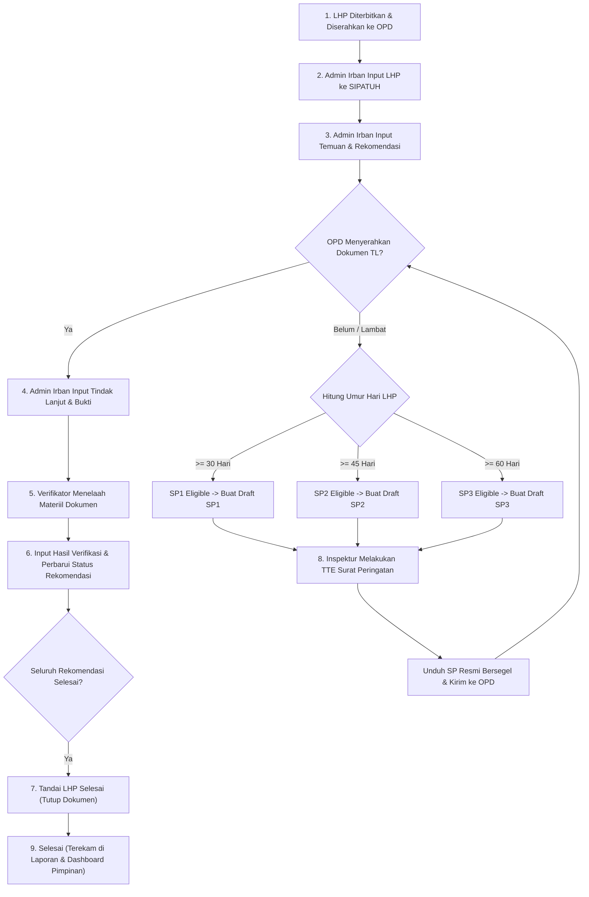

# PANDUAN PENGOPERASIAN APLIKASI SIPATUH
**Sistem Informasi Pemantauan Hasil Pemerintahan**  
*Inspektorat Daerah Kabupaten Konawe Selatan*

---

## DAFTAR ISI

1. [Tentang SIPATUH](#1-tentang-sipatuh)
   - [1.1 Latar Belakang & Tujuan](#11-latar-belakang--tujuan)
   - [1.2 Prinsip Bisnis Fundamental](#12-prinsip-bisnis-fundamental)
   - [1.3 Landasan Kebijakan & Aturan Waktu](#13-landasan-kebijakan--aturan-waktu)
2. [Peran Pengguna (User Roles) & Matriks Hak Akses](#2-peran-pengguna-user-roles--matriks-hak-akses)
3. [Alur Kerja Utama Sistem (End-to-End Workflow)](#3-alur-kerja-utama-sistem-end-to-end-workflow)
4. [Akses Sistem & Autentikasi](#4-akses-sistem--autentikasi)
   - [4.1 Persyaratan Perangkat & Browser](#41-persyaratan-perangkat--browser)
   - [4.2 Masuk ke Sistem (Login)](#42-masuk-ke-sistem-login)
   - [4.3 Struktur Antarmuka & Navigasi](#43-struktur-antarmuka--navigasi)
   - [4.4 Keluar dari Sistem (Logout)](#44-keluar-dari-sistem-logout)
5. [Panduan Operasional: Pengelolaan LHP, Temuan, dan Rekomendasi](#5-panduan-operasional-pengelolaan-lhp-temuan-dan-rekomendasi)
   - [5.1 Menjelajahi Daftar LHP & Menggunakan Filter](#51-menjelajahi-daftar-lhp--menggunakan-filter)
   - [5.2 Mendaftarkan LHP Baru](#52-mendaftarkan-lhp-baru)
   - [5.3 Mengubah Data LHP & Mengunduh Berkas LHP](#53-mengubah-data-lhp--mengunduh-berkas-lhp)
   - [5.4 Mengelola Temuan Hasil Pemeriksaan](#54-mengelola-temuan-hasil-pemeriksaan)
   - [5.5 Mengelola Rekomendasi Pengawasan](#55-mengelola-rekomendasi-pengawasan)
   - [5.6 Menandai LHP Selesai (Penutupan LHP)](#56-menandai-lhp-selesai-penutupan-lhp)
   - [5.7 Membuka Kembali LHP (Reopen LHP)](#57-membuka-kembali-lhp-reopen-lhp)
6. [Panduan Operasional: Tindak Lanjut & Verifikasi Manual](#6-panduan-operasional-tindak-lanjut--verifikasi-manual)
   - [6.1 Membuka Linimasa Tindak Lanjut](#61-membuka-linimasa-tindak-lanjut)
   - [6.2 Mencatat Dokumen Tindak Lanjut dari OPD](#62-mencatat-dokumen-tindak-lanjut-dari-opd)
   - [6.3 Membaca Kartu Akuntabilitas Finansial](#63-membaca-kartu-akuntabilitas-finansial)
   - [6.4 Melakukan Verifikasi Manual](#64-melakukan-verifikasi-manual)
   - [6.5 Menelusuri Linimasa Histori (Audit Trail)](#65-menelusuri-linimasa-histori-audit-trail)
7. [Panduan Operasional: Surat Peringatan & Tanda Tangan Elektronik (TTE)](#7-panduan-operasional-surat-peringatan--tanda-tangan-elektronik-tte)
   - [7.1 Ketentuan Umur LHP & Level Surat Peringatan](#71-ketentuan-umur-lhp--level-surat-peringatan)
   - [7.2 Tab Jatuh Tempo & Menerbitkan Draft SP](#72-tab-jatuh-tempo--menerbitkan-draft-sp)
   - [7.3 Pratinjau Berkas Draft PDF](#73-pratinjau-berkas-draft-pdf)
   - [7.4 Proses Penandatanganan Elektronik (TTE BSrE)](#74-proses-penandatanganan-elektronik-tte-bsre)
   - [7.5 Mengunduh Dokumen Resmi Bersegel Elektronik](#75-mengunduh-dokumen-resmi-bersegel-elektronik)
8. [Panduan Operasional: Dashboard Pemantauan](#8-panduan-operasional-dashboard-pemantauan)
   - [8.1 Dashboard Operasional Admin Irban](#81-dashboard-operasional-admin-irban)
   - [8.2 Dashboard Pimpinan (Bupati & Inspektur)](#82-dashboard-pimpinan-bupati--inspektur)
9. [Panduan Operasional: Pelaporan & Ekspor Data](#9-panduan-operasional-pelaporan--ekspor-data)
   - [9.1 Mengatur Filter Multivariat](#91-mengatur-filter-multivariat)
   - [9.2 Menganalisis Matriks Kinerja per Perangkat Daerah](#92-menganalisis-matriks-kinerja-per-perangkat-daerah)
   - [9.3 Ekspor ke Format Excel (.csv)](#93-ekspor-ke-format-excel-csv)
   - [9.4 Ekspor ke Format Dokumen PDF Landscape](#94-ekspor-ke-format-dokumen-pdf-landscape)
10. [Panduan Administrator Sistem (Super Admin)](#10-panduan-administrator-sistem-super-admin)
    - [10.1 Manajemen Pengguna & Wilayah Irban](#101-manajemen-pengguna--wilayah-irban)
    - [10.2 Pemetaan Unit Kerja (OPD) ke Irban](#102-pemetaan-unit-kerja-opd-ke-irban)
    - [10.3 Pengelolaan Pejabat Unit Kerja (Kepala OPD)](#103-pengelolaan-pejabat-unit-kerja-kepala-opd)
    - [10.4 Pengelolaan Master Data](#104-pengelolaan-master-data)
11. [Tanya Jawab & Penanganan Masalah (FAQ & Troubleshooting)](#11-tanya-jawab--penanganan-masalah-faq--troubleshooting)

---

## 1. Tentang SIPATUH

### 1.1 Latar Belakang & Tujuan
**SIPATUH (Sistem Informasi Pemantauan Hasil Pemerintahan)** adalah aplikasi web terintegrasi yang digunakan secara internal oleh **Inspektorat Daerah Kabupaten Konawe Selatan**. 

Aplikasi ini dikembangkan untuk memodernisasi tata kelola pengawasan intern, khususnya dalam memantau, mendokumentasikan, memverifikasi, dan menyusun laporan atas perkembangan tindak lanjut Laporan Hasil Pemeriksaan (LHP).

Tujuan utama penerapan SIPATUH:
1. **Pemusatan Data Pengawasan**: Mengeliminasi risiko dokumen tercecer dan duplikasi pencatatan manual.
2. **Akuntabilitas & Audit Trail**: Menyediakan histori perubahan status, pencatatan dokumen bukti, dan hasil verifikasi secara kronologis (*append-only*).
3. **Pemantauan Kepatuhan Real-Time**: Mengotomasi perhitungan umur LHP dan mekanisme penerbitan Surat Peringatan (SP1, SP2, SP3) bertingkat.
4. **Validitas Hukum melalui TTE**: Mengintegrasikan penerbitan surat peringatan dengan Tanda Tangan Elektronik (TTE) bersertifikat Balai Sertifikasi Elektronik (BSrE).
5. **Dashboard Eksekutif**: Menyajikan laporan komprehensif bagi Bupati Konawe Selatan dan Inspektur Daerah untuk pengambilan kebijakan strategis.

---

### 1.2 Prinsip Bisnis Fundamental

Dalam mengoperasikan SIPATUH, setiap pengguna wajib memahami 5 prinsip dasar berikut:

1. **Organisasi Perangkat Daerah (OPD) Bukan Pengguna Aplikasi**:
   * Perangkat Daerah / OPD yang diperiksa **tidak memiliki akun** login di SIPATUH.
   * Dokumen fisik maupun digital hasil tindak lanjut diserahkan secara resmi oleh pihak OPD ke kantor Inspektorat Daerah.
   * Petugas yang bertugas menginput berkas dan keterangan tindak lanjut ke dalam sistem adalah **Admin Irban** yang membawahi OPD tersebut.
2. **Verifikasi Dilakukan 100% Manual oleh Manusia**:
   * Sistem **tidak pernah** mengubah status rekomendasi menjadi *"Sesuai"* atau *"Selesai"* secara otomatis.
   * Walaupun nilai setoran uang kas daerah telah mencapai 100% dari nilai rekomendasi finansial, verifikator manusia tetap wajib memeriksa keabsahan materiil dokumen STS (Surat Tanda Setor) atau bukti administrasi dan memberikan catatan pertimbangan verifikasi tertulis.
3. **Isolasi Wilayah Irban (Irban Scoping)**:
   * Inspektorat Daerah Kabupaten Konawe Selatan terbagi ke dalam 5 Inspektur Pembantu (Irban I s.d. Irban V / Irban Khusus).
   * Akun Admin Irban hanya berhak mengelola data LHP dan rekomendasi di lingkungan unit kerja binaannya.
4. **Histori Tindak Lanjut Abadi (Append-Only)**:
   * Setiap penyerahan dokumen tindak lanjut oleh OPD dicatat sebagai entri baru yang membentuk linimasa (*timeline*). Entri lama tidak pernah ditimpa agar rekam jejak audit tetap utuh.
5. **Keamanan Kredensial & TTE**:
   * Data akun bersumber dari Single Identity EGOV Kabupaten Konawe Selatan.
   * Passphrase penandatanganan elektronik tidak pernah disimpan ke basis data atau log, dan langsung dibersihkan dari memori seketika setelah penandatanganan selesai.

---

### 1.3 Landasan Kebijakan & Aturan Waktu

Berdasarkan regulasi pengawasan (Peraturan Bupati Konawe Selatan No. 1 Tahun 2012):
* **Batas Waktu Tindak Lanjut**: Selambat-lambatnya **60 hari kalender**.
* **Basis Perhitungan**: Dihitung sejak tanggal dokumen LHP diterima oleh entitas/OPD (`tanggal_diterima_lhp`), bukan dari tanggal penerbitan LHP.
* **Jadwal Eskalasi Surat Peringatan**:
  * **SP1 (Surat Peringatan I)**: Diterbitkan jika umur tindak lanjut $\ge$ **30 hari kalender**.
  * **SP2 (Surat Peringatan II)**: Diterbitkan jika umur tindak lanjut $\ge$ **45 hari kalender**.
  * **SP3 (Surat Peringatan III)**: Diterbitkan jika umur tindak lanjut $\ge$ **60 hari kalender**.

---

## 2. Peran Pengguna (User Roles) & Matriks Hak Akses

SIPATUH memiliki 3 peran pengguna (Role) utama:

| Fitur / Modul | SUPER_ADMIN (Inspektur) | ADMIN_IRBAN | BUPATI |
| :--- | :---: | :---: | :---: |
| **Cakupan Wilayah** | Seluruh Wilayah (Irban I - V) | Terbatas pada 1 Irban Terdaftar | Seluruh Wilayah |
| **Sifat Akses** | Penuh (Kelola & Pimpinan) | Operasional Harian | *Strictly Read-Only* |
| **Dashboard Pimpinan** | Ya | Tidak | Ya |
| **Dashboard Irban** | Ya | Ya (Sesuai Irban) | Tidak |
| **Kelola LHP, Temuan, Rekomendasi** | Ya | Ya (Sesuai Irban) | Tidak |
| **Input Tindak Lanjut OPD** | Ya | Ya (Sesuai Irban) | Tidak |
| **Verifikasi Manual Rekomendasi** | Ya | Ya (Sesuai Irban) | Tidak |
| **Tandai Selesai LHP (Close)** | Ya | Ya (Sesuai Irban) | Tidak |
| **Buka Kembali LHP (Reopen)** | **Ya (Khusus Inspektur)** | Tidak | Tidak |
| **Buat Draft Surat Peringatan** | Ya | Ya (Sesuai Irban) | Tidak |
| **Tanda Tangan Elektronik (TTE BSrE)** | **Ya (Penandatangan Utama)** | Tidak | Tidak |
| **Laporan & Ekspor Data** | Ya (Seluruh Irban) | Ya (Wilayah Sendiri) | Ya (Seluruh Irban) |
| **Aktivasi & Kelola Pengguna EGOV** | **Ya** | Tidak | Tidak |
| **Pemetaan OPD SIMPEG & Pejabat** | **Ya** | Tidak | Tidak |
| **Kelola Master Data & Template Surat** | **Ya** | Tidak | Tidak |

---

## 3. Alur Kerja Utama Sistem (End-to-End Workflow)

Berikut adalah diagram alir siklus pengawasan LHP di SIPATUH:

---

## 4. Akses Sistem & Autentikasi

### 4.1 Persyaratan Perangkat & Browser
* **Perangkat**: Komputer PC, Laptop, atau Tablet dengan koneksi internet/intranet Pemerintah Daerah.
* **Peramban Web (Browser) Rekomendasi**: Google Chrome versi terbaru, Microsoft Edge, Mozilla Firefox, atau Safari.
* **Resolusi Layar**: Optimal pada resolusi layar minimal $1280 \times 720$ piksel.

### 4.2 Masuk ke Sistem (Login)
Akun pengguna SIPATUH terhubung langsung dengan **Single Identity EGOV Pemerintah Kabupaten Konawe Selatan**. Anda tidak perlu mendaftar mandiri; akun Anda diaktifkan oleh Super Admin Inspektorat.

**Langkah-langkah login:**
1. Buka peramban web dan akses alamat URL portal SIPATUH (misal: `https://sipatuh.konaweselatankab.go.id` atau URL instalasi lokal jaringan Anda).
2. Anda akan diarahkan ke halaman login.
3. Masukkan **NIP** (18 digit) atau **Username EGOV** Anda pada kolom yang disediakan.
4. Masukkan **Kata Sandi (Password) EGOV** Anda.
5. Klik tombol **Masuk ke SIPATUH**.
6. Sistem akan memverifikasi kredensial ke server EGOV dan memeriksa status aktivasi akun di SIPATUH. Jika valid, Anda akan langsung diarahkan ke halaman dashboard kerja sesuai peran Anda:
   * **Admin Irban** diarahkan otomatis ke **Dashboard Irban** (`/dashboard/irban`).
   * **Super Admin / Inspektur** dan **Bupati** diarahkan otomatis ke **Dashboard Pimpinan** (`/dashboard/pimpinan`).

> [!NOTE]
> Sistem menggunakan mekanisme cookie terproteksi (*HTTP-Only*). Token sesi Anda diperbarui secara aman di latar belakang (*auto-refresh*) selama peramban terbuka.

### 4.3 Struktur Antarmuka & Navigasi
Setelah berhasil masuk, Anda akan melihat tampilan antarmuka yang terdiri dari:
1. **Bilah Samping (Sidebar Navigation)**:
   * **Seksi Pengawasan**: Dashboard Pimpinan, Dashboard Irban, LHP, Surat Peringatan, dan Laporan.
   * **Seksi Administrasi** (khusus Super Admin): Pengguna & Irban, Unit Kerja & Pejabat, Master Data.
2. **Bilah Atas (Top Header)**:
   * Menampilkan nama aplikasi dan judul menu aktif.
   * Menampilkan profil pengguna: Nama lengkap, badge peran (`SUPER_ADMIN`, `ADMIN_IRBAN`, `BUPATI`), serta nama wilayah Irban yang sedang aktif.
   * Tombol cepat navigasi dan tombol **Keluar (Logout)**.

### 4.4 Keluar dari Sistem (Logout)
Untuk menjaga keamanan data dan audit trail:
1. Klik tombol **Keluar** atau ikon pintu keluar pada pojok kanan atas layar.
2. Sistem akan membersihkan sesi aman dan mengarahkan Anda kembali ke halaman login.
3. Pastikan untuk selalu melakukan logout jika Anda menggunakan komputer bersama.

---

## 5. Panduan Operasional: Pengelolaan LHP, Temuan, dan Rekomendasi

Menu **LHP** (`/lhp`) adalah pusat operasional utama pengelolaan pengawasan hasil pemeriksaan. Menu ini hanya dapat diakses oleh **SUPER_ADMIN** dan **ADMIN_IRBAN**.

---

### 5.1 Menjelajahi Daftar LHP & Menggunakan Filter
Pada halaman daftar LHP, Anda dapat mencari dan menyaring berkas pemeriksaan secara fleksibel:
* **Pilihan Tahun Pengawasan**: Memilih tahun pelaksanaan audit (default: tahun berjalan).
* **Filter Status**:
  * *Semua Dokumen*: Menampilkan seluruh LHP.
  * *Proses*: Menampilkan LHP yang masih memiliki rekomendasi belum tuntas.
  * *Selesai Ditandai*: Menampilkan LHP yang sudah dinyatakan tuntas dan ditutup.
* **Filter Jenis Pemeriksaan**: Memilih kategori pemeriksaan (Ketaatan, Kinerja, Tujuan Tertentu, Investigatif).
* **Filter Wilayah Irban** (hanya aktif bagi Super Admin): Memilih Irban I s.d. Irban V. Bagi Admin Irban, data telah dikunci otomatis ke wilayah binaannya.
* **Pencarian Cepat**: Ketik nomor LHP atau nama Perangkat Daerah (OPD) pada kotak pencarian untuk menemukan data seketika.

---

### 5.2 Mendaftarkan LHP Baru
Langkah mencatat dokumen LHP baru:
1. Klik tombol **+ Tambah LHP** di bagian kanan atas tabel.
2. Jendela formulir (*modal*) pendaftaran LHP akan muncul:
   * **Nomor Dokumen LHP** *(Wajib)*: Masukkan nomor register resmi LHP (contoh: `700/012/ITDA/2026`).
   * **Perangkat Daerah (OPD) Terperiksa** *(Wajib)*: Pilih OPD target dari daftar unit kerja binaan Irban Anda.
   * **Jenis Pemeriksaan** *(Wajib)*: Pilih jenis pengawasan yang sesuai (Ketaatan, Kinerja, Investigatif, dll).
   * **Tanggal Penerbitan LHP** *(Wajib)*: Tanggal resmi saat naskah LHP ditandatangani.
   * **Tanggal Diterima LHP oleh OPD** *(Wajib & Krusial)*: Tanggal fisik tanda terima penyerahan berkas LHP ke kepala OPD. Tanggal ini menjadi **dasar perhitungan batas waktu 60 hari kalender** untuk penerbitan Surat Peringatan.
   * **Periode Pemeriksaan** *(Opsional)*: Masukkan tanggal mulai dan selesai pemeriksaan lapangan jika ada.
   * **Keterangan / Ringkasan Dokumen** *(Opsional)*: Catatan tambahan mengenai ruang lingkup audit.
   * **Unggah Berkas Fisik LHP** *(Opsional)*: Unggah file pindaian resmi naskah LHP dalam format **PDF**.
3. Periksa kembali seluruh data, lalu klik **Simpan Dokumen LHP**.
4. Sistem akan membuat entri LHP baru dan mengunci snapshot kepemilikan wilayah Irban.

---

### 5.3 Mengubah Data LHP & Mengunduh Berkas LHP
* **Mengubah Data**: Klik tombol ikon **Pensil (Ubah)** pada baris LHP yang ingin diperbarui. Perubahan data hanya dapat dilakukan jika LHP belum berstatus ditutup.
* **Mengunduh Berkas PDF**: Jika berkas PDF telah diunggah, klik ikon **Unduh (Download File)** pada kolom aksi. Berkas akan langsung diunduh secara aman ke perangkat Anda.

---

### 5.4 Mengelola Temuan Hasil Pemeriksaan
Setiap dokumen LHP memiliki satu atau lebih **Temuan**. Untuk mengelola temuan:
1. Klik tombol **Lihat Detail** atau nomor LHP yang bersangkutan. Jendela detail LHP akan terbuka.
2. Gulir ke bagian **Temuan & Rekomendasi Hasil Pemeriksaan**.
3. Untuk menambahkan temuan baru, klik tombol **+ Tambah Temuan**:
   * **Judul Temuan** *(Wajib)*: Masukkan judul pokok temuan (contoh: *Kekurangan Volume Pekerjaan Peningkatan Jalan Ruas A*).
   * **Uraian Kondisi Temuan** *(Wajib)*: Jelaskan secara terperinci fakta kondisi yang ditemukan tim pemeriksa.
   * **Nilai Finansial / Kerugian Daerah (Rp)** *(Opsional)*: Masukkan nominal potensi kerugian daerah dalam angka rupiah jika temuan bermuatan finansial. Jika bersifat administratif murni, biarkan kosong atau isi 0.
4. Klik **Simpan Temuan**. Temuan akan tercatat dengan nomor urut berjenjang (Temuan #1, Temuan #2, dst).

---

### 5.5 Mengelola Rekomendasi Pengawasan
Setiap temuan dapat memiliki satu atau beberapa instruksi **Rekomendasi**.
1. Pada kartu temuan yang bersangkutan, klik tombol **+ Tambah Rekomendasi**:
   * **Uraian Instruksi Rekomendasi** *(Wajib)*: Masukkan instruksi tindakan korektif yang wajib dipenuhi OPD (contoh: *Memerintahkan Rekanan PT X menyetorkan kelebihan bayar sebesar Rp45.000.000 ke Kas Daerah*).
   * **Status Rekomendasi Awal** *(Wajib)*: Sistem secara default memilih status awal berkategori belum selesai (contoh: *Belum Ditindaklanjuti* atau *Belum Sesuai*).
   * **Nilai Kewajiban Pengembalian (Rp)** *(Opsional)*: Masukkan nominal kewajiban setor kas daerah jika rekomendasi mewajibkan pemulihan finansial.
2. Klik **Simpan Rekomendasi**.
3. Rekomendasi akan tampil dengan nomor urut anak (misal: Rekomendasi #1.1, Rekomendasi #1.2) lengkap dengan status badge dan rekapitulasi nilai finansial.

---

### 5.6 Menandai LHP Selesai (Penutupan LHP)
Jika seluruh rekomendasi hasil pemeriksaan telah dituntaskan oleh OPD dan telah selesai diverifikasi oleh tim pemeriksa:
1. Buka rincian LHP atau klik tombol **Tandai Selesai** pada baris tabel LHP.
2. **Syarat Sistem**: Tombol konfirmasi penutupan hanya akan aktif apabila **100% rekomendasi telah berstatus berkategori SELESAI** (misalnya status *Sesuai* atau *Tidak Dapat Ditindaklanjuti*).
3. Jika masih ada satu saja rekomendasi berstatus belum selesai, sistem akan menampilkan peringatan dan mencegah penutupan LHP.
4. Jika syarat terpenuhi, klik **Konfirmasi Selesai & Tutup LHP**.
5. Setelah ditutup, dokumen LHP berada dalam mode terkunci (*Read-Only*) untuk mencegah perubahan data yang tidak sah.

---

### 5.7 Membuka Kembali LHP (Reopen LHP)
Apabila di kemudian hari ditemukan bukti baru atau arahan pimpinan untuk memeriksa ulang LHP yang telah ditutup:
* **Hanya SUPER_ADMIN (Inspektur)** yang memiliki wewenang membuka kembali LHP yang telah ditutup.
* Klik tombol **Buka Kembali LHP**.
* Masukkan **Alasan Pembukaan Kembali** secara terperinci (wajib).
* Klik **Konfirmasi Buka Kembali**. Sistem akan mengaktifkan kembali status LHP dan mencatat identitas pemeriksa, waktu, dan alasan pembukaan ke dalam *Audit Trail*.

---

## 6. Panduan Operasional: Tindak Lanjut & Verifikasi Manual

Modul ini adalah jantung akuntabilitas SIPATUH yang menangani pencatatan bukti dari OPD serta keputusan verifikasi oleh pemeriksa.

---

### 6.1 Membuka Linimasa Tindak Lanjut
1. Pada jendela detail LHP, temukan rekomendasi yang akan ditindaklanjuti.
2. Klik tombol **Tindak Lanjut & Verifikasi** atau klik badge jumlah dokumen pada kartu rekomendasi.
3. Panel laci geser (**Tindak Lanjut Drawer**) akan muncul dari sisi kanan layar, memuat data temuan induk, detail rekomendasi, kartu akuntabilitas finansial, serta linimasa histori dokumen.

---

### 6.2 Mencatat Dokumen Tindak Lanjut dari OPD
Ketika perwakilan OPD datang membawa berkas tindak lanjut ke kantor Inspektorat:
1. Pada drawer tindak lanjut, klik tombol **+ Input Tindak Lanjut**.
2. Formulir pencatatan tindak lanjut akan terbuka:
   * **Tanggal Dokumen Diterima dari OPD** *(Wajib)*: Pilih tanggal saat OPD resmi menyerahkan dokumen ke Inspektorat.
   * **Uraian Tindak Lanjut** *(Wajib)*: Tuliskan penjelasan tindakan perbaikan yang dilakukan oleh OPD berdasarkan surat pengantarnya.
   * **Nilai Setoran Kas Daerah (Rp)** *(Opsional)*: Jika OPD menyerahkan bukti setor bank/STS (Surat Tanda Setor), masukkan nominal rupiah yang telah disetor ke kas daerah.
   * **Unggah Berkas Bukti Fisik** *(Wajib)*: Unggah pindaian dokumen bukti (Surat Pengantar, Bukti STS, Foto Fisik Pekerjaan, dll). Berkas yang didukung adalah format **PDF, JPG, atau PNG** dengan ukuran berkas **maksimal 5 MB**.
3. Klik **Simpan Tindak Lanjut**.
4. Berkas akan terunggah ke penyimpanan terproteksi dan entri baru akan muncul di posisi teratas linimasa.

---

### 6.3 Membaca Kartu Akuntabilitas Finansial
Jika rekomendasi memiliki nilai nominal keuangan, kartu **Akuntabilitas Finansial** akan menampilkan:
* **Target Rekomendasi**: Total kewajiban pengembalian kasda.
* **Realisasi Setor Kasda**: Akumulasi seluruh setoran sah yang telah diinput pada setiap berkas tindak lanjut.
* **Sisa Tunggakan**: Nilai selisih kewajiban yang belum disetorkan.
* **Bilah Persentase (Progress Bar)**: Rasio pelunasan dalam persen.

> [!IMPORTANT]
> **Peringatan Sistem**:  
> *"Pelunasan finansial 100% tidak otomatis mengubah status rekomendasi menjadi Selesai. Verifikasi keabsahan dokumen wajib 100% dilakukan manual oleh verifikator manusia."*

---

### 6.4 Melakukan Verifikasi Manual
Setelah berkas tindak lanjut diperiksa materiilnya oleh tim verifikator:
1. Temukan kartu tindak lanjut pada linimasa drawer, lalu klik tombol **Verifikasi Dokumen**.
2. Jendela formulir verifikasi akan terbuka:
   * **Keputusan / Status Rekomendasi Baru** *(Wajib)*: Pilih status baru yang ditetapkan oleh verifikator:
     * *Sesuai*: Dokumen telah sah, lengkap, dan rekomendasi tuntas.
     * *Belum Sesuai*: Dokumen diserahkan namun belum memenuhi kriteria rekomendasi secara utuh.
     * *Tidak Dapat Ditindaklanjuti*: Berdasarkan kajian hukum/kondisi khusus tidak memungkinkan ditindaklanjuti lagi.
   * **Catatan Pertimbangan Verifikasi** *(Wajib)*: Tuliskan telaah dan dasar pertimbangan mengapa status tersebut diberikan (contoh: *Bukti STS Bank Sultra No. Rek. 001 telah diverifikasi sah sebesar Rp45.000.000, fisik pekerjaan telah dicek lapangan dan sesuai spesifikasi teknis*).
   * **Unggah Dokumen Verifikasi / Berita Acara** *(Opsional)*: Lampirkan Berita Acara Pemantauan Tindak Lanjut jika ada (PDF/JPG/PNG max 5MB).
3. Klik **Simpan Hasil Verifikasi**.
4. Status rekomendasi induk akan langsung terbarui, dan keputusan verifikasi tercatat secara permanen di bawah dokumen tindak lanjut tersebut.

---

### 6.5 Menelusuri Linimasa Histori (Audit Trail)
Setiap tindakan input tindak lanjut dan hasil verifikasi dicatat berurutan dari waktu ke waktu:
* Siapa pengguna yang mencatat tindak lanjut dan tanggal penerimaannya.
* Tautan unduh berkas bukti fisik OPD.
* Siapa petugas verifikator yang memverifikasi, waktu verifikasi, catatan pertimbangan, serta perubahan status rekomendasi yang dihasilkan.

---

## 7. Panduan Operasional: Surat Peringatan & Tanda Tangan Elektronik (TTE)

Modul **Surat Peringatan** (`/surat-peringatan`) dirancang untuk menegakkan kepatuhan tindak lanjut berdasarkan batas waktu Perbup Konawe Selatan No. 1 Tahun 2012.

---

### 7.1 Ketentuan Umur LHP & Level Surat Peringatan
Sistem mengevaluasi umur LHP secara otomatis berdasarkan rumus:
$$\text{Umur Hari} = \text{Hari Ini} - \text{Tanggal Diterima LHP}$$

Kriteria kelayakan penerbitan surat:
1. **SP1 (Surat Peringatan I)**: Umur LHP $\ge$ **30 hari kalender**, masih memiliki rekomendasi belum selesai, dan SP1 belum pernah diterbitkan untuk LHP tersebut.
2. **SP2 (Surat Peringatan II)**: Umur LHP $\ge$ **45 hari kalender**, masih memiliki rekomendasi belum selesai, SP1 sudah terbit, dan SP2 belum pernah diterbitkan.
3. **SP3 (Surat Peringatan III)**: Umur LHP $\ge$ **60 hari kalender**, masih memiliki rekomendasi belum selesai, SP2 sudah terbit, dan SP3 belum pernah diterbitkan.

---

### 7.2 Tab Jatuh Tempo & Menerbitkan Draft SP
1. Buka menu **Surat Peringatan** pada sidebar.
2. Buka tab **Jatuh Tempo (Due)**.
3. Tabel akan menampilkan daftar seluruh LHP yang telah melampaui batas waktu peringatan:
   * Nomor LHP & Nama OPD Tujuan.
   * Tanggal Terima LHP dan perhitungan umur hari saat ini.
   * Jumlah rekomendasi yang masih tertunggak.
   * Badge status kelayakan (SP1 / SP2 / SP3).
4. Klik tombol **Buat SP** pada baris LHP yang ingin diproses.
5. Modal pembuatan Surat Peringatan akan terbuka:
   * **Level Surat**: Ditentukan otomatis oleh sistem (SP1, SP2, atau SP3).
   * **Nomor Surat Resmi** *(Wajib)*: Masukkan nomor registrasi surat keluar Inspektorat (contoh: `700/045/SP-1/ITDA/2026`). Nomor surat wajib unik.
   * **Tanggal Surat** *(Wajib)*: Masukkan tanggal penerbitan surat.
   * **Pejabat Penerima Surat**: Sistem menampilkan nama, NIP, dan jabatan Kepala OPD tujuan (otomatis memprioritaskan PLT/PLH aktif jika ada).
   * **Daftar Rekomendasi Tertunggak**: Sistem menampilkan daftar seluruh rekomendasi yang saat ini belum selesai. Daftar ini akan **dikunci (snapshot)** ke dalam naskah surat agar tidak berubah meskipun di kemudian hari rekomendasi tersebut diselesaikan.
6. Klik **Terbitkan Draft Surat Peringatan**.
7. Sistem membuat draf surat dan menyusun berkas PDF unsigned.

---

### 7.3 Pratinjau Berkas Draft PDF
1. Pindah ke tab **Daftar SP Diterbitkan**.
2. Anda akan melihat daftar surat peringatan berstatus `DRAFT`.
3. Klik tombol **Lihat Detail** atau tombol **Unduh Draft PDF** untuk memeriksa tata letak surat, nomor, tanggal, nama pejabat tujuan, dan tabel rincian rekomendasi tertunggak.

---

### 7.4 Proses Penandatanganan Elektronik (TTE BSrE)

> [!NOTE]
> Fitur penandatanganan TTE hanya dapat dilakukan oleh akun dengan peran **SUPER_ADMIN (Inspektur Daerah)** selaku penandatangan utama berwenang.

Langkah-langkah penandatanganan:
1. Pada baris surat peringatan bertatus `DRAFT`, klik tombol **Tanda Tangan Elektronik (TTE)**.
2. Modal autentikasi TTE aman akan terbuka:
   * Tinjau ringkasan dokumen: Nomor surat, level, dan OPD tujuan.
   * Masukkan **NIK Penandatangan** (16 digit NIK Inspektur terdaftar di BSrE).
   * Masukkan **Passphrase TTE** (kata sandi sertifikat elektronik pribadi Anda).
3. Klik tombol **Tandatangani Dokumen Sekarang**.
4. Sistem akan melakukan proses enkripsi dan mengirim berkas PDF ke layanan eSign BSrE melalui kanal aman:
   * Passphrase Anda **hanya digunakan sekali di memori backend** dan tidak pernah disimpan di database, log, maupun file.
   * Sistem mengunci proses (*concurrency lock*) guna mencegah klik ganda.
5. Jika berhasil, sistem menampilkan pesan sukses dan mengubah status surat peringatan menjadi **SIGNED**.

> [!CAUTION]
> **Prinsip Imutabilitas Dokumen**:  
> Dokumen yang telah berhasil ditandatangani secara elektronik (SIGNED) bersifat **permanen dan berkekuatan hukum tetap**. Surat tersebut tidak dapat diubah, dihapus, atau ditandatangani ulang.

---

### 7.5 Mengunduh Dokumen Resmi Bersegel Elektronik
1. Pada tab **Daftar SP Diterbitkan**, surat yang telah ditandatangani akan memiliki badge hijau **SIGNED**.
2. Klik tombol **Unduh PDF Resmi (Signed)**.
3. Berkas PDF yang diunduh memuat visual tanda tangan digital, tautan verifikasi keaslian BSrE, dan segel elektronik resmi Pemerintah Kabupaten Konawe Selatan yang siap dikirimkan kepada Kepala OPD yang bersangkutan.

---

## 8. Panduan Operasional: Dashboard Pemantauan

### 8.1 Dashboard Operasional Admin Irban
Menu `/dashboard/irban` dirancang khusus untuk memandu kerja harian auditor dan tim di masing-masing wilayah kerja:
1. **Ringkasan Kartu Statistik**:
   * *Total LHP Wilayah*: Memperlihatkan jumlah LHP yang telah ditutup (*Closed*) vs yang masih dalam proses (*Open*).
   * *Status Rekomendasi*: Total rekomendasi tuntas vs belum tuntas beserta persentase capaian.
   * *Peringatan SP Due*: Jumlah LHP binaan yang telah masuk batas waktu SP1, SP2, atau SP3.
   * *Pemulihan Kerugian Finansial*: Total nilai uang rekomendasi, realisasi setor ke Kas Daerah, dan sisa tunggakan rupiah.
2. **Distribusi Status Rekomendasi**:
   * Menampilkan sebaran data sesuai master status aktif (Sesuai, Belum Sesuai, Belum Ditindaklanjuti, Tidak Dapat Ditindaklanjuti).
3. **Pemberitahuan LHP Jatuh Tempo (Alert Widget)**:
   * Kotak atensi merah/oranye yang mencantumkan LHP kritis yang wajib segera ditindaklanjuti atau diterbitkan surat peringatan.
4. **Tabel LHP Terkini**:
   * Daftar cepat dokumen pemeriksaan aktif wilayah kerja untuk navigasi instan ke detail LHP.

---

### 8.2 Dashboard Pimpinan (Bupati & Inspektur)
Menu `/dashboard/pimpinan` menyajikan data makro tingkat kabupaten tanpa rincian teknis yang membebani pimpinan daerah:
1. **Kartu KPI Makro Pengawasan Daerah**:
   * Akumulasi seluruh LHP se-Kabupaten Konawe Selatan.
   * Total temuan hasil pengawasan.
   * Persentase capaian penyelesaian rekomendasi kabupaten.
   * Total Surat Peringatan yang telah diterbitkan (rincian SP1, SP2, SP3).
   * Total kewajiban kerugian kas daerah, realisasi setoran kasda, dan sisa kerugian yang belum dipulihkan.
2. **Grafik Komparasi Kinerja Antar-Irban**:
   * Membandingkan tingkat penyelesaian rekomendasi (%) dan nilai pemulihan kas daerah antara Irban I, Irban II, Irban III, Irban IV, dan Irban Khusus secara transparan dan berimbang.
3. **Tabel Top 5 Perangkat Daerah Tertunggak**:
   * Menampilkan 5 OPD dengan jumlah rekomendasi belum selesai terbanyak di Kabupaten Konawe Selatan beserta sisa kewajiban keuangannya sebagai bahan atensi rapat koordinasi pimpinan.
4. **Filter Tahun**:
   * Pimpinan dapat memilih tahun evaluasi pengawasan untuk melihat perbandingan kinerja dari tahun ke tahun.

---

## 9. Panduan Operasional: Pelaporan & Ekspor Data

Menu **Laporan** (`/laporan`) menyediakan sarana penyusunan laporan berkala pengawasan dan ekspor dokumen resmi. Modul ini dapat diakses oleh seluruh peran (`SUPER_ADMIN`, `ADMIN_IRBAN`, `BUPATI`).

---

### 9.1 Mengatur Filter Multivariat
Panel filter di bagian atas halaman laporan memungkinkan penyesuaian parameter:
* **Tahun Pemeriksaan**: Memilih tahun data pengawasan.
* **Wilayah Irban**: Memilih Irban I s.d. Irban V (otomatis terkunci untuk Admin Irban).
* **Perangkat Daerah (OPD)**: Menyaring khusus untuk satu dinas/badan/kecamatan tertentu.
* **Jenis Pemeriksaan**: Menyaring berdasarkan jenis audit.
* **Status Rekomendasi**: Menyaring data berdasarkan status tertentu.
* Klik tombol **Terapkan Filter** untuk memuat ulang laporan, atau klik **Reset** untuk kembali ke parameter default.

---

### 9.2 Menganalisis Matriks Kinerja per Perangkat Daerah
Tabel matriks memuat rekapitulasi kinerja setiap OPD:
* Nama Perangkat Daerah dan Irban Pembina.
* Jumlah dokumen LHP dan total temuan.
* Rincian rekomendasi: Total Rekomendasi, Rekomendasi Selesai, dan Rekomendasi Belum Selesai.
* **Tingkat Persentase Penyelesaian (%)**.
* Nilai Rekomendasi Finansial (Rp), Realisasi Setor Kasda (Rp), dan Sisa Tunggakan (Rp).
* **Fitur Pencarian & Urutan Kolom**:
  * Gunakan kolom pencarian cepat untuk memfilter nama dinas secara instan.
  * Klik judul kolom (misal: *% Selesai* atau *Sisa Tunggakan*) untuk mengurutkan data dari tertinggi ke terendah (*sort desc/asc*).

---

### 9.3 Ekspor ke Format Excel (.csv)
Untuk mengolah data lebih lanjut dalam lembar kerja Excel:
1. Pastikan filter yang diinginkan telah diterapkan.
2. Klik tombol **Ekspor Excel** (ikon hijau spreadsheet).
3. Sistem akan menghasilkan file CSV terstruktur yang diunduh langsung oleh peramban web.
4. Berkas siap dibuka di Microsoft Excel, Google Sheets, atau aplikasi pengolah data lainnya.

---

### 9.4 Ekspor ke Format Dokumen PDF Landscape
Untuk keperluan pelaporan resmi kepada pimpinan atau arsip cetak:
1. Klik tombol **Ekspor PDF** (ikon merah dokumen).
2. Sistem akan menyusun naskah laporan rekapitulasi dalam format PDF bersusun mendatar (*landscape*) lengkap dengan kop dokumen, ringkasan capaian, dan matriks OPD.
3. Berkas PDF akan langsung terunduh secara rapi dan siap dicetak.

---

## 10. Panduan Administrator Sistem (Super Admin)

Menu seksi **Administrasi** hanya dapat diakses oleh pengguna dengan peran **SUPER_ADMIN** (Inspektur / Admin TI Inspektorat).

---

### 10.1 Manajemen Pengguna & Wilayah Irban
Menu `/pengguna` mengelola akun lokal SIPATUH dan master 5 Irban:
1. **Aktivasi Akun EGOV**:
   * SIPATUH tidak menyimpan kata sandi pengguna; seluruh otentikasi diverifikasi ke server EGOV.
   * Klik **Aktivasi Akun EGOV**.
   * Cari data ASN berdasarkan NIP atau nama pegawai dari direktori EGOV.
   * Tentukan **Peran (Role)**: `SUPER_ADMIN`, `ADMIN_IRBAN`, atau `BUPATI`.
   * Jika memilih `ADMIN_IRBAN`, Anda **wajib memilih penugasan tepat ke salah satu Irban** (Irban I s.d. Irban V).
   * Klik **Aktifkan Pengguna**.
2. **Mengubah Peran atau Memindahkan Wilayah Irban**:
   * Klik ikon **Ubah (Edit)** pada baris pengguna terdaftar.
   * Perbarui role atau pindahkan penugasan wilayah Irban, lalu klik **Simpan**.
3. **Menonaktifkan / Mengaktifkan Akses Pengguna**:
   * Klik toggle status aktif pada baris pengguna.
   * Konfirmasi penonaktifan. Akun yang dinonaktifkan tidak akan dapat masuk ke sistem SIPATUH, namun data ASN di server EGOV tetap aman.
4. **Mengelola Data Irban**:
   * Buka tab **Wilayah Kerja Irban**.
   * Anda dapat memperbarui nama resmi dan keterangan deskripsi dari masing-masing 5 Irban.

---

### 10.2 Pemetaan Unit Kerja (OPD) ke Irban
Menu `/unit-kerja` pada tab **Pemetaan Unit Kerja**:
1. Menampilkan daftar seluruh Perangkat Daerah yang disinkronisasi dari basis data SIMPEG (khusus unit kerja definitif dengan `unit_induk = 1`).
2. **Menugaskan OPD ke Irban**:
   * Cari OPD yang belum dipetakan.
   * Klik tombol **Tugaskan Irban**.
   * Pilih Irban pembina yang bertanggung jawab mengawasi OPD tersebut.
   * Klik **Simpan Pemetaan**.
3. **Memindahkan / Melepas Penugasan (Unassign)**:
   * Klik tombol **Lepas Penugasan** jika terjadi penyesuaian struktur organisasi pengawasan. Konfirmasi pelepasan.
   * *Catatan*: Perubahan pemetaan OPD di masa kini tidak akan merusak riwayat LHP lama karena LHP menyimpan *snapshot* wilayah Irban saat LHP dibuat.

---

### 10.3 Pengelolaan Pejabat Unit Kerja (Kepala OPD)
Menu `/unit-kerja` pada tab **Pejabat Unit Kerja**:
Surat peringatan memerlukan nama, NIP, dan jabatan Kepala OPD tujuan yang sah. Data ini dikelola secara fleksibel:
1. Klik **+ Tambah Pejabat**:
   * Pilih **Perangkat Daerah (OPD)** tujuan.
   * Masukkan **NIP** dan **Nama Lengkap Pejabat** (beserta gelar).
   * Masukkan **Nama Jabatan** (contoh: *Kepala Dinas Pekerjaan Umum dan Tata Ruang*).
   * Pilih **Jenis Penugasan**:
     * `DEFINITIF`: Pejabat definitif yang memegang surat keputusan pelantikan.
     * `PLT`: Pelaksana Tugas.
     * `PLH`: Pelaksana Harian.
   * Masukkan **Tanggal Mulai Tugas** dan **Tanggal Selesai** (opsional).
2. **Aturan Resolusi Otomatis Pejabat**:
   * Sistem secara cerdas mengutamakan pejabat berstatus **PLT atau PLH yang masih aktif** sebagai kandidat utama penerima surat resmi dibanding pejabat definitif.
   * Seorang ASN diperbolehkan memiliki jabatan definitif di OPD asalnya dan merangkap sebagai PLT di OPD lain secara sah.

---

### 10.4 Pengelolaan Master Data
Menu `/master-data` mengelola referensi dinamis sistem:
1. **Jenis Pemeriksaan**:
   * Menambah atau memperbarui kategori pengawasan (contoh: Ketaatan, Kinerja, Khusus, Investigasi).
   * Mengatur status aktif/nonaktif jenis pemeriksaan.
2. **Status Rekomendasi**:
   * Mengelola taksonomi status (Sesuai, Belum Sesuai, Belum Ditindaklanjuti, Tidak Dapat Ditindaklanjuti).
   * Mengatur **Kategori Internal**: `SELESAI` (menandai rekomendasi tuntas) atau `BELUM_SELESAI` (menandai rekomendasi masih tertunggak).
3. **Template Surat Peringatan**:
   * Mengelola naskah baku untuk SP1, SP2, dan SP3.
   * Format template mendukung variabel pengganti dinamis seperti `{{nomor_surat}}`, `{{tanggal_surat}}`, `{{nama_pejabat}}`, `{{opd_nama}}`, dan tabel rincian rekomendasi.
   * **Tag Jangkar TTE**: Setiap template surat wajib menyertakan kode `#tagTTD#` pada posisi tanda tangan pimpinan sebagai koordinat visual penempatan sertifikat digital BSrE.

---

## 11. Tanya Jawab & Penanganan Masalah (FAQ & Troubleshooting)

### Q1: Mengapa saya tidak bisa login dengan pesan "Akun Anda belum terdaftar di SIPATUH"?
> **Solusi**: Akun Anda sudah terdaftar di sistem EGOV, namun belum diaktifkan oleh Super Admin Inspektorat di sistem SIPATUH. Silakan hubungi Administrator SIPATUH / Inspektorat untuk mengaktifkan akun dan menetapkan peran serta wilayah Irban Anda.

### Q2: Mengapa OPD yang bersangkutan tidak memiliki akun untuk mengunggah berkasnya sendiri?
> **Jawaban**: Sesuai prinsip bisnis SIPATUH, OPD bukan pengguna sistem. Hal ini dirancang untuk menjaga integritas data dan memastikan setiap dokumen yang masuk ke sistem telah melalui penerimaan resmi dan verifikasi awal oleh tim Inspektorat (Admin Irban).

### Q3: OPD telah melunasi kerugian daerah 100%, mengapa rekomendasi masih berstatus Belum Selesai?
> **Jawaban**: Sesuai aturan pengawasan, pelunasan nominal uang tidak otomatis mengubah status menjadi "Selesai". Verifikator wajib memeriksa bukti setor (STS), mengecek fisik bila diperlukan, lalu melakukan **Verifikasi Manual** melalui laci tindak lanjut dan memilih status baru *"Sesuai"*.

### Q4: Mengapa tombol "Tandai Selesai" pada LHP tidak dapat diklik / dinonaktifkan?
> **Solusi**: LHP hanya dapat ditutup jika **seluruh rekomendasi** di bawah semua temuannya telah berstatus berkategori `SELESAI` (seperti status "Sesuai" atau "Tidak Dapat Ditindaklanjuti"). Periksa kembali daftar rekomendasi dan pastikan tidak ada yang masih tertunggak.

### Q5: Mengapa penandatanganan TTE Surat Peringatan gagal?
> **Kemungkinan Penyebab & Solusi**:
> 1. *Passphrase salah*: Pastikan Anda memasukkan kata sandi sertifikat BSrE dengan benar (perhatikan huruf besar/kecil).
> 2. *NIK tidak cocok*: Pastikan NIK yang dimasukkan sesuai dengan profil pemilik sertifikat elektronik Inspektur di BSrE.
> 3. *Koneksi jaringan*: Pastikan server terhubung dengan layanan eSign wrapper Kabupaten Konawe Selatan.

### Q6: Bagaimana jika LHP yang sudah ditutup perlu diperiksa ulang karena adanya temuan baru?
> **Solusi**: Hubungi **Super Admin (Inspektur)**. Hanya Super Admin yang memiliki hak membuka kembali (*Reopen*) dokumen LHP yang telah ditutup dengan menyertakan alasan resmi yang akan tersimpan dalam riwayat audit.

### Q7: Berkas bukti tindak lanjut gagal diunggah?
> **Solusi**: Pastikan ukuran berkas tidak melebihi **5 MB** dan format berkas adalah dokumen **PDF, JPG, atau PNG**. Jika berkas terlalu besar, lakukan kompresi terlebih dahulu sebelum mengunggah.

---

*Dokumen Panduan Pengoperasian SIPATUH Versi 1.0 — Inspektorat Daerah Kabupaten Konawe Selatan.*
